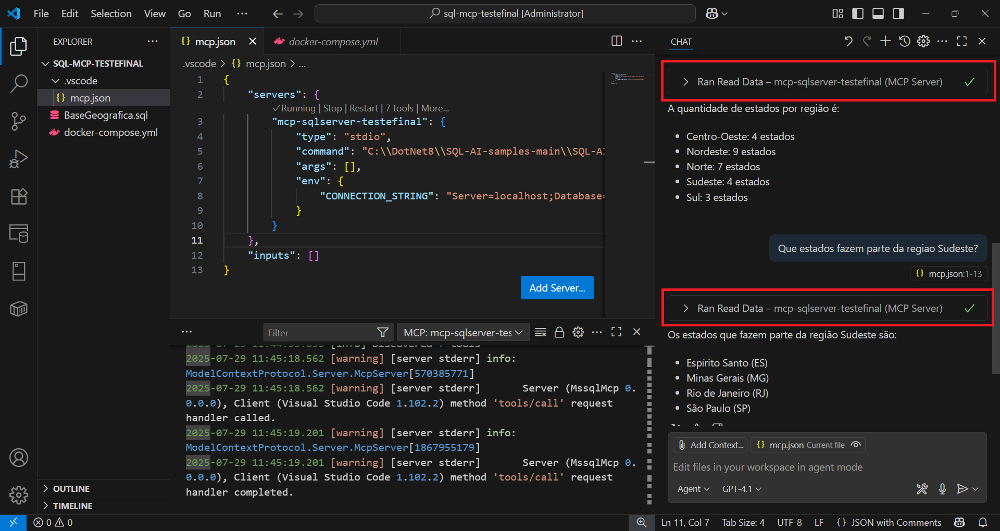

# sqlserver-mcp-scripts
Exemplo de uso do MCP do SQL Server com um server de banco de dados containerizado e consultado a dados de regiões do Brasil. Inclui Docker Compose para criação do ambiente de testes.

Arquivo mcp.json com configurações informados no Visual Studio Code:

```json
{
    "servers": {
        "mcp-sqlserver-testefinal": {
            "type": "stdio",
            "command": "C:\\DotNet8\\SQL-AI-samples-main\\SQL-AI-samples-main\\MssqlMcp\\dotnet\\MssqlMcp\\bin\\Debug\\net8.0\\MssqlMcp.exe",
            "args": [],
            "env": {
                "CONNECTION_STRING": "Server=localhost;Database=BaseDadosGeograficos;User Id=sa;Password=SqlServer2025!;TrustServerCertificate=True;"
            }
        }
    },
    "inputs": []
}
```

Exemplo de uso do MCP do SQL Server a partir do Visual Studio Code:

